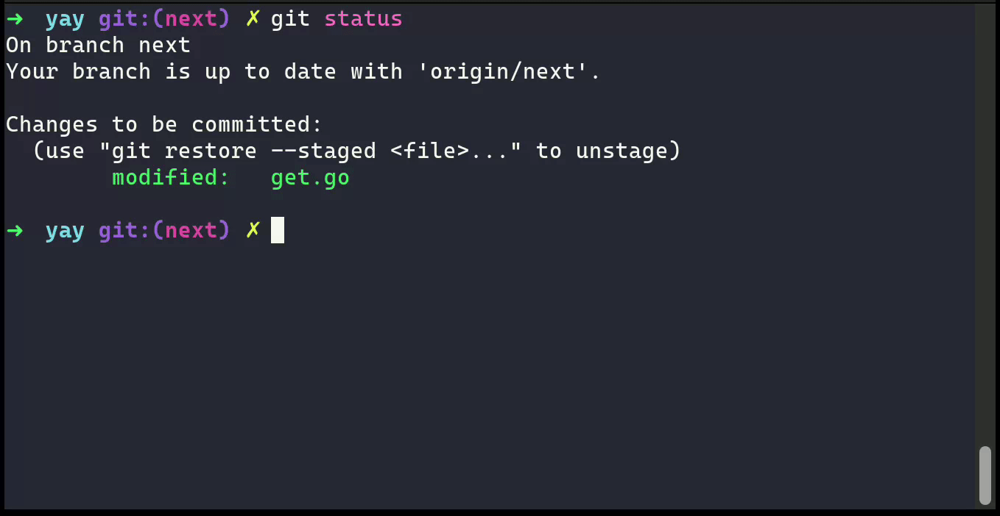

# Git Add Co-Author
Git command that adds co-authors to the latest commit.

## Features
- Interactive search and selection
- Multi select co-authors with Tab/Shift-Tab
## Usage
```
git add-co-author
```



## Installation for single user
1. Make sure you have installed [fzf](https://github.com/junegunn/fzf),
2. Make sure to create a setup for local binaries:
   1. Create a directory for local binaries: `mkdir ~/.local/bin`
   1. Add it to the *PATH* for local usage:
      - If you use bash, place following line in your `~/.bash_profile`:
        - ```export PATH="${PATH}:/~/.local/bin"```
      - If you use fish, place following line in your `~/.config/fish/config.fish`:
        - ```set -gx PATH "$HOME/.local/bin" $PATH```
3. Install git command: ```wget https://raw.githubusercontent.com/Offpics/git-add-co-author/main/bin/git-add-co-author -P ~/.local/bin && chmod +x ~/.local/bin/git-add-co-author```
